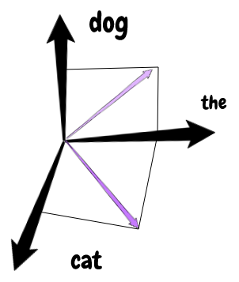

# \#2 - Models of Computation and Document Distance

### What's an algorithm?

A computer procedure to solve a problem.

| CS | Mathematical Analog |
| :--- | :--- |
| Program | Algorithm |
| Programming Language | Pseudo-code |
| Computer | Model of Computation |

### Models of Computation

Specifies:

* What operations an algorithm is allowed.
* The time cost of each operation.

#### Model types:

1. **RAM \(Random Access Machine\)**
   * This is the mathematical analog of Random Access Memory, modeled like a big array composed by an index and a word.
   * In RAM we can load words, do computations and store words in constant time O\(1\)
2. **Pointer Machine**
   * Dynamically allocated objects.
   * An object has O\(1\) fields, where a field can a word, a pointer to another object or null.

The models RAM and Pointer Machine are theoretical models design to be simple where everything you do takes constant time.


### Document Distance Problem



> The distance here means finding out whether two documents are similar or not.

* Documents are sequences of words.
* Words are strings with alphanumeric chars.
* Get the shared words to calculate the distance \(similarity\) between documents.
* Think of a document as a vector.



* Split the documents into words
* Compute the word frequecy
* Find the "dot product"



We can try to define the distance between documents using the _dot product_

$$
d'(D1, D2) = D1 * D2
$$

But we have a problem because this is not scale invariant. To solve this issue we can divide the _dot product_ with the length of the vectors  \(vectors magnitude\), like:

$$
d'(D1, D2) = D1 * D2 / |D1| * |D2|
$$

This is the formula of cosine of the angle between vectors.

**Example**

**D1, D2 = "the dog", "the cat"**



#### Implementation example

```python
import sys
import string
import math


def read_file(file_path):
    with open(file_path, "r") as fp:
        return fp.read()


def split_words(raw_text):
    translate_table = str.maketrans(
        string.ascii_uppercase,
        string.ascii_lowercase,
        string.punctuation
    )
    text = raw_text.translate(translate_table)
    return text.split()


def word_frequency(word_list):
    word_set = set(word_list)
    return {
        word: word_list.count(word)
        for word in word_set
    }


def dot_product(vec_one, vec_two):
    value = 0
    for key in vec_one.keys():
        if key in vec_two:
           value += vec_one[key] * vec_two[key]
    return value

def vector_magnitude(vec_one, vec_two):
    def operation(vec):
        result = sum([
            value**2
            for value in vec.values()
        ])
        return math.sqrt(result)
    return operation(vec_one) * operation(vec_two)


def angle(vec_one, vec_two):
    result = dot_product(vec_one, vec_two) / vector_magnitude(vec_one, vec_two)
    return math.acos(result)


def main():
    file_one = sys.argv[1]
    file_two = sys.argv[2]

    text_one = read_file(file_one)
    text_two = read_file(file_two)

    list_one = split_words(text_one)
    list_two = split_words(text_two)

    frequency_one = word_frequency(list_one)
    frequency_two = word_frequency(list_two)

    distance = angle(frequency_one, frequency_two)
    print("{:6f}".format(distance))


if __name__ == "__main__":
    main()

```

